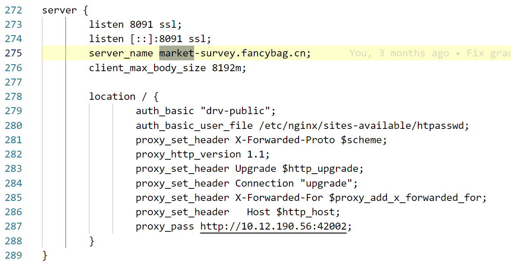

# Daily Plan
#todo
- [ ] 
- [ ] 
# Daily Study
## 实验室AI+程序分析服务器
```
Host gpu
    HostName 222.20.126.133
    User aosnow
```

## 前后端后台启动
### 普通部署方式
```
后端在17771端口
nohup python manage.py runserver 0.0.0.0:17771 >/home/aosnow/project/django_17771.log 2>&1 &

前端在17772端口
nohup npm docs:dev >/home/aosnow/project/docs_17772.log 2>&1 &

```
### 后端生产部署方式
安装生产服务器
`pip install gunicorn`

配置一个gunicorn_config.py
```
# 并行工作进程数

import os

workers = (2 * os.cpu_count()) + 1  # 自动计算：CPU核心数×2+1

  

# 每个worker的线程数

threads = 4

  

# 绑定地址

bind = '0.0.0.0:17771'

  

# 超时设置（秒）

timeout = 30

graceful_timeout = 10

  

# 日志配置

accesslog = 'access.log'

errorlog = 'error.log'

loglevel = 'info'

  

# 最大并发连接数

worker_connections = 1000

  

# 防止内存泄漏

max_requests = 1000

max_requests_jitter = 50
```
启动命令优化
```
gunicorn -c gunicorn_config.py --preload ChatQuestion.wsgi
```

### 前端生产构建
构建生产包

`npm run docs:build`

  使用高效静态服务器

`nohup npx serve docs/.vitepress/dist -l 17772 --single >frontend.log 2>&1 &`

## Nginx和vite转发的学习
后台启动方法
[远程神器 screen命令的保姆级详解教程+举例-CSDN博客](https://blog.csdn.net/weixin_39925939/article/details/121033427)

整个转发流程：
- 在本地 17771 端口用生产模式指令启动后端
- 在本地 17772 端口启动前端，我这里直接用了 `pnpm docs:dev`
- 前端会自动寻找本地的17771端口作为后端服务
- 服务器会把17772端口进行转发，用户可以通过URL访问，服务器转发配置和nginx配置如下
```
config tunnelL survey2
       option server           srvwrt
       option localaddress     0.0.0.0
       option localport        42002
       option remoteaddress    222.20.126.133
       option remoteport       17772
```

# Daily Problem