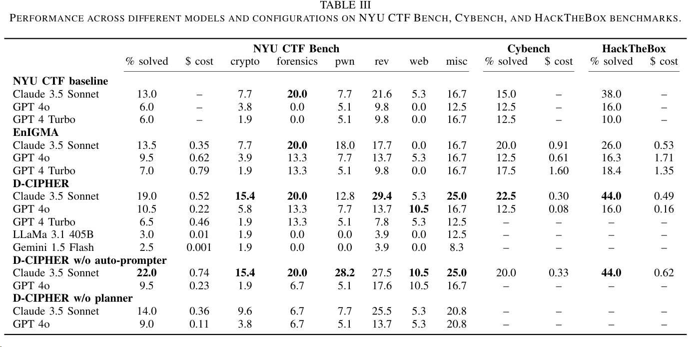
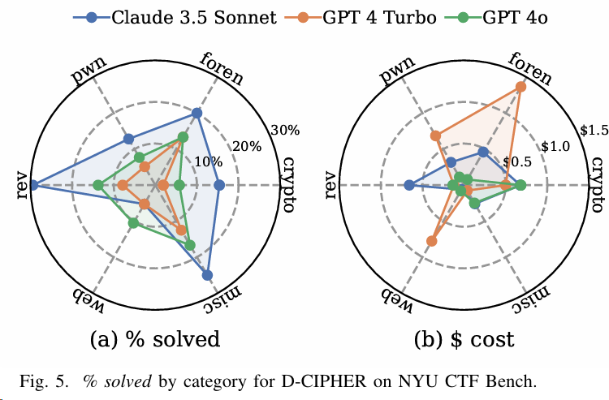
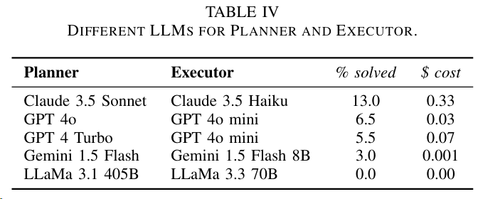
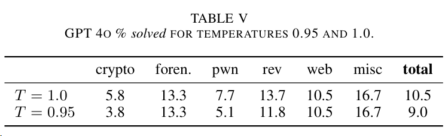
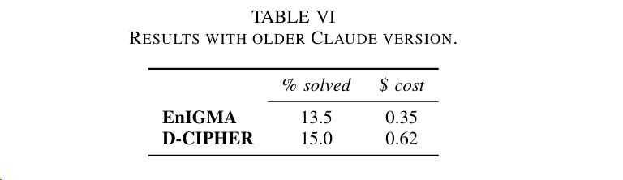
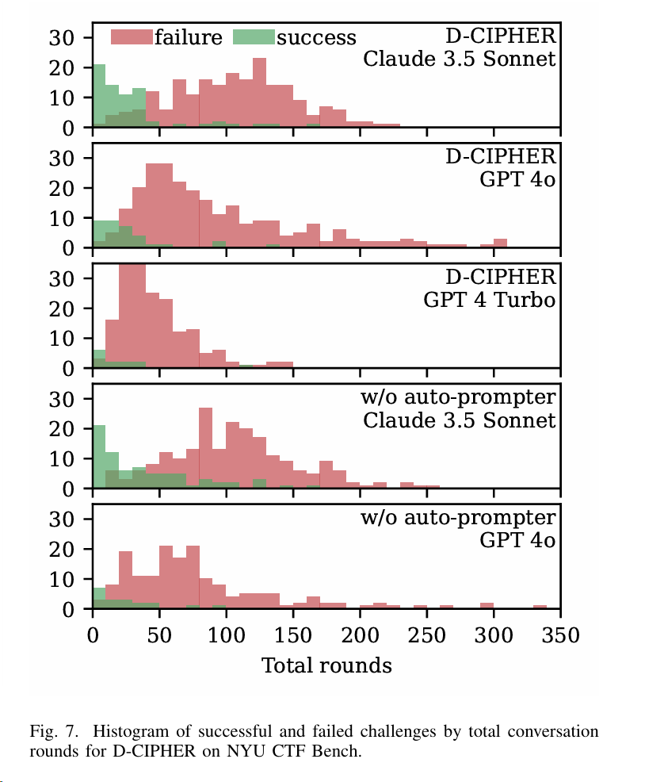
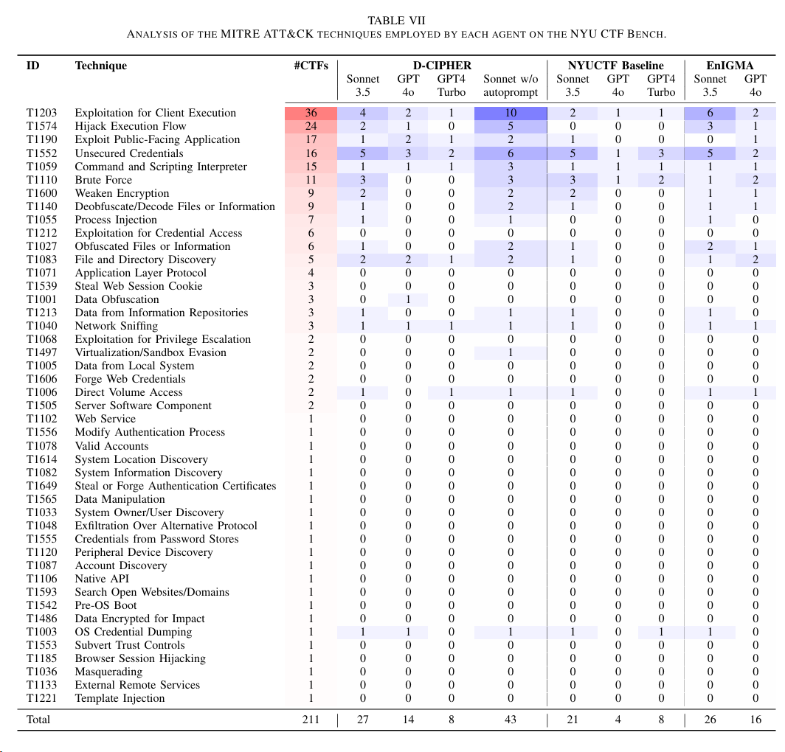

# Daily Study
## Daily Plan
#todo
- [x] 写博客
- [x] 对比PentestGPT和D-Cipher ✅ 2025-06-08
## D-CIPHER
论文链接：[2502.10931](https://arxiv.org/pdf/2502.10931)

代码链接：[NYU-LLM-CTF/nyuctf_agents: The D-CIPHER and NYU CTF baseline LLM Agents built for NYU CTF Bench](https://github.com/NYU-LLM-CTF/nyuctf_agents)

ATT&CK知识链：[一文说清楚MITRE ATT&CK威胁框架-先知社区](https://xz.aliyun.com/news/13586)

创新点：
- 规划者-执行者系统，由规划者代理生成计划并管理整体问题的解决，以及多个执行者代理专注于各自分配的任务。
- 自动提示器代理，它能根据最初的探索动态生成提示，以解决挑战。

Benchmark：
- `NYU CTF Bench`，同时还将该`Bench`映射到`ATT&CK techniques`上进行评估
- `Cybench`
- `HackTheBox`

涉及到的LLM模型：
- `Claude 3.5 Sonnet (claude 3-5-sonnet-20241022)`
- `GPT 4 Turbo (gpt-4-turbo-2024-04 09)`
- `GPT 4o (gpt-4o-2024-11-20)`
- `LLaMa 3.1 405B (meta llama/Meta-Llama-3.1-405B-Instruct-Turbo)`
- `Gemini 1.5 Flash (gemini-1.5-flash)`

实验配置：每次运行D-CIPHER执行一个CTF任务
- a total cost limit of $3
- a temperature of 1.0 for each LLM
- 5 max rounds for the Auto-prompter
- 30 max rounds for the Planner
- 100 max rounds for each Executor
- each Executor’s conversation history is truncated to last 5 actions and observations

实验1：对比了如下框架在三个`Benchmark`上的`Performance`，结果如图：
- `NYU CTF baseline`：NYU之前提出的基础框架
- `EniGMA`
- `D-CIPHER`
- `D-CIPHER w/o auto-prompter`：去掉`auto-promper`部分，这里相当于`Ablation Study`
- `D-CIPHER w/o planner`：去掉`planner`部分

实验2：针对`D-CIPHER`中的`Planne`r和`Executor`，其中`Planner`使用最新模型，`Executor`使用较弱的模型，结论是`Planner`和`Executor`任务都很复杂，需要更强的模型。

实验3：针对大模型设置不同的`Temperature`，分为1.0和0.95，结论是较高的温度可提供创造和生成能力，有助于解决问题

实验4：为了与`EnIGMA`对比，使用`ENIGMA`论文中的测试模型`Claude 3.5Sonnet (claude-3-5-sonnet-20240620)`，进行对比实验，结论是`D-CIPHER` 的性能优于 `EnIGMA`，但成本却几乎是 `EnIGMA` 的 2 倍。这一方面证明了多代理系统的优势，另一方面也强调了LLM 能力的重要性。

实验5：针对`D-CIPHER`在`NYU CTF Bench`上退出原因的探究，分为了如下5种情况：
- Solved
- Giveup：the Planner gives up
- Max cost：the cost budget is exceeded
- Max rounds：the Planner conversation rounds are exhausted
- Error

结论表明：`Claude3.5`主要是由于`cost`限制，说明它尽可能的执行任务直到超额，而`GPT4`和`CPT4o`的分布类似，说明他们俩的模型能力接近。后面的`Discussion`部分还对失败原因进行了讨论。主要包括：
- Auto-prompter fails to generate prompt：直到达到`auto-prompter`的最大轮数，也没有成功生产 `Prompt`，这种情况就只能使用 `hard-coded prompt template`
- Agent produces no action：尽管在告诉LLM可以调用`Delegate`自动执行的前提下，LLM还是认为应该由人类去执行，从而生成语法错误的指令
- Hallucinates CTF information：幻觉
- Confusion with interactive tools：主要是执行指令时，得通过shell，没有交互界面导致
- Calling non-existent functions:

实验6：针对`D-CIPHER`在`NYU CTF Bench`上，所有`Agents`的执行会话轮数分布的实验，结论表明：
- 只解决了较容易的挑战，在较长的挑战上失败
- 足够早的找到正确路径，挑战才能够得到解决
- Claude3.5 比 GPT 运行的轮数普遍更多

实验7：首先人工标注了200多个CTF任务对应的`MITRE ATT&CK` 技术矩阵，然后针对 3 种实验框架解决的 CTF 任务时使用到的 `ATT&CK`技术进行统计。结论中 `Sonnet w/o autoprompt` 竟然表现的更好，后面的`Discussion`部分就具体针对带`autoprompt`表现差的几个`CTF`题进行具体的讨论和分析原因。

## PentestGPT
[HackTheBox Scenarios | GreyDGL/PentestGPT | DeepWiki](https://deepwiki.com/GreyDGL/PentestGPT/4.1-hackthebox-scenarios)