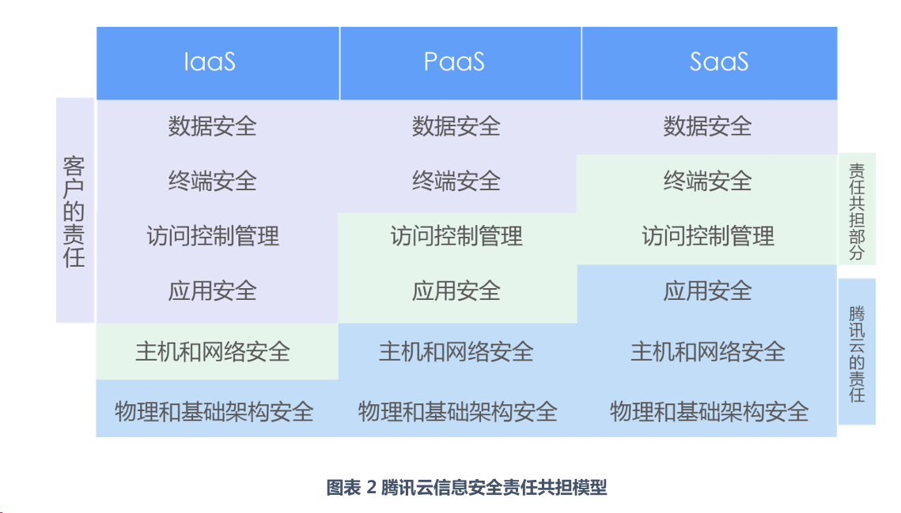

xxx'x'x'x'x'x'x'x'x'xx'x'x'x'x'xx'x'x'x'x'xx# Daily Study
## Daily Plan
#todo
- [x] 写博客
- [x] DOS防护和安全防护
## eBPF Agent相关
### 整个Agent有什么优点/创新/特点
我认为该Agent的优点主要分为两个层面：架构层面和具体eBPF容器监控层面

架构层面是采用了完整的四层架构，构建了一个完整的从数据到可视化的流向。利用每一层专有的功能将eBPF的利用和容器的监控、可视化进行解耦，能够更好的帮助我们了解系统的运行状态、快速定位问题并优化系统性能，来处理云原生观测中典型的三个问题：
- 架构监控和整合难：微服务架构导致监控和故障排查困难，传统工具整合应用和基础架构指标较为困难。
-  数据分析和处理差：Kubernetes等环境中数据量大，分析效果差，传统工具处理数据一致性和故障转移的能力差。
- 资源响应和集成弱：普通开源监控工具在处理大规模集群会遇到性能瓶颈，对资源响应与集成能力较弱。

eBPF容器监控层面则是基于eBPF开发了一个轻量高性能的云原生监控程序，主要有四个亮点：
- 热更新:允许在不中断服务的情况下，动态地通过网络接口 API 启停特定的 ebpf 跟踪器。
- 可扩展:核心框架高度模块化可扩展，提高了系统的灵活性，还降低了维护升级的复杂性，可以轻松接入其他的 ebpf 程序。
- 轻量化:避免了复杂环境配置，能够在极小的内存占用下启动。
- 高性能:在内核层面实现数据过滤、聚合等工作,减少了向用户空间发送的数据量。系统采用C/C++编写，CPU使用率不超过5%

具体解释一下亮点的原因
- 热更新的原因：基于Libbpf的，支持运行时加载/卸载 BPF 程序，由于我们采用了模块化设计，通过网络接口动态启停、替换内核 eBPF 程序，无需重启主 Agent 进程。
- 轻量化的原因：基于Libbpf的CO-RE，实现一次编译到处运行，仅需4MB即可在支持的内核容器启动跟踪

为什么可以做到不重启和不停机
- 内核态/用户态分离  
    eBPF 相关探针和程序运行在内核态，与主 Agent 进程（用户态）解耦。卸载和加载 BPF 程序不会影响用户态主进程，因此主进程无需重启，业务不中断。
- 动态 API 管理  
    通过 HTTP API 动态管理，使得探针的启动、停止、替换均可在线完成，不会中断采集系统，也无需停机维护。
- 模块化和轻量级设计  
    每个 eBPF 跟踪器作为独立模块管理，更新时只影响被替换的部分；系统整体资源占用极低（3-4% 性能损耗），即使切换探针也不会引发性能抖动。

### 开销和影响
配置：4核12G，启动了一个包含6个容器和负载均衡的服务，以及Prometheus 和 Grafana，使用wrk进行压测
- top指令观察到，Agent进程的CPU占用在2%-3%
- 对未开启Agent和开启Agent后，使用wrk用12个线程，400并发连接，持续30s，观察到QPS损耗在1.4%，延迟提升0.2ms，整体性能损失在3%~4%

### 难点
我认为主要的难点包括两个层面：系统层面和具体的ebpf开发层面，具体来说：
- 系统层面主要是数据的流向逻辑，主要包括三个步骤：
	- 数据采集：系统通过libbpf库与内核交互，收集网络(net)、进程(process)等数据。这些数据可以以json或csv格式存储。
	- 数据处理：系统通过Analyzer模块对数据进行分析处理，生成告警信息。
	- 数据展示：通过grafana对收集到的数据和告警信息进行展示。 通过从分层的数据流动，结合具体的功能模块，实现监控观测功能。
- eBPF开发层面，主要包括：
	- eBPF程序必须严格遵守内核安全的限制进行开发
	- 为了来实现高性能和低开销，基于libbpf进行相应探针和程序的设计
	- 为了实现内核与用户态的协同、热更新和动态管理，同样是基于libbpf设计相应的API，以及采用模块化设计每一个跟踪器

## 云安全攻防矩阵

参考链接：[腾讯安全云鼎实验室-云安全攻防矩阵](https://cloudsec.tencent.com/home/)

总结：[云鼎攻防矩阵](../Misc/Security/Web安全/云鼎攻防矩阵.md)
### 什么是云原生
云原生 (Cloud Native) 不是指某个具体的产品，而是一套思想理念、文化和技术的集合。它的核心目标是让应用程序从设计之初就为“云”这种动态、分布式的环境而生，从而能够充分利用云平台的弹性、分布式、高可用等优势。

云原生的四大支柱：
- 微服务
- 容器化
- 容器编排
- DevOps

云原生的优势：
- **弹性伸缩 (Elasticity)**：能够根据业务需求，在几秒或几分钟内自动扩展或缩减资源，既能应对流量洪峰，又能节省成本。
- **高可用性 (High Availability)**：系统被设计为可容忍局部故障，通过自动化的自我修复机制保证整体服务的稳定运行。
- **开发敏捷性 (Agility)**：大大缩短了新功能从想法到上线的周期，让企业能够更快地进行创新和试错。
- **无厂商锁定 (No Vendor Lock-in)**：基于以Kubernetes为核心的开源技术栈，使得应用可以方便地在不同的云提供商（如AWS, Azure, Google Cloud, 阿里云）之间迁移，甚至部署在自己的数据中心

### 云计算三种服务模式
云计算服务通常被划分为三个层次，它们分别是 **IaaS、PaaS 和 SaaS**。这三种模式的核心区别在于云服务提供商与用户之间**责任和管理范围**的不同。

| 责任范围  | IaaS                  | Paas                        | Saas                                |
| ----- | --------------------- | --------------------------- | ----------------------------------- |
| 用户管理  | 应用程序、数据、运行环境、中间件、操作系统 | 应用程序、数据                     | （几乎不管理）                             |
| 服务商管理 | 网络、存储、服务器、虚拟化         | 网络、存储、服务器、虚拟化、操作系统、中间件、运行环境 | 网络、存储、服务器、虚拟化、操作系统、中间件、运行环境、数据、应用程序 |
| 比喻    | 租用厨房                  | 使用外卖的半成品                    | 去餐厅吃饭                               |
