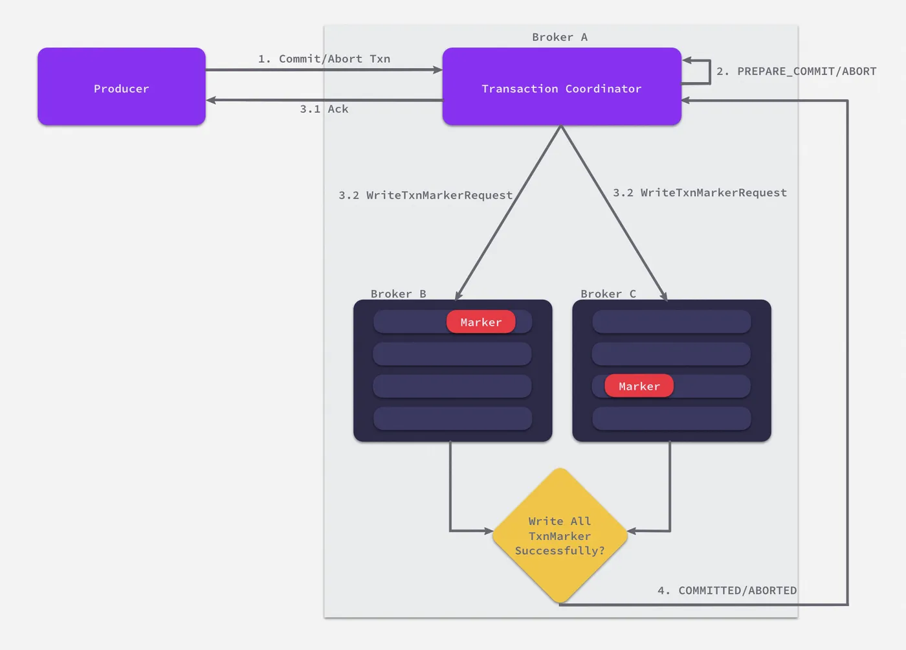

# Daily Study
## Daily Plan
#todo
- [x] 写博客
- [ ] 
## Kafka的消息传递语义

在任何分布式消息系统中，消息从生产者（Producer）发送到消费者（Consumer）的途中，都可能因为网络抖动、服务重启、节点故障等原因而出错。消息传递语义就是我们对这种不确定性所做的承诺。常见的消息传递语义有三种：
- **At Most Once (至多一次)**：消息可能会丢失，但绝不会重复。性能最高，但可靠性最低。
- **At Least Once (至少一次)**：消息绝不会丢失，但可能会重复。可靠性高，是绝大多数场景的**默认选择**。
- **Exactly Once (恰好一次)**：消息既不会丢失，也不会重复。可靠性最高，但实现最复杂，开销也最大。

不同的消息传递语义都要从生产者、Broker、消费者三个方面展开分析。
### At Least Once
这是Kafka**最常用、最基础**的可靠性保证。它承诺消息一定会被成功写入，但由于重试机制的存在，可能会导致消费者重复处理同一条消息。

**1. 生产者端 (Producer)**

- **`acks=all` (或 `-1`)**：这是**最关键**的配置。它告诉生产者，在发送消息后，必须等待分区的Leader副本不仅自己写入成功，并且所有处于“同步状态”（In-Sync Replicas, ISR）的Follower副本也都**全部确认收到**该消息后，才算发送成功。
    - **作用**：这样可以确保即使Leader节点在确认后立即宕机，消息也已经存在于其他副本中，不会丢失。
- **配置重试机制 (Retries)**：生产者必须配置一个大于0的重试次数。当发生网络抖动等可恢复的错误导致发送失败时，生产者会自动重新发送该消息。

**2. Broker端 (Kafka集群)**

- `replication.factor >= 3`：主题分区的副本因子至少设置为3（或更高），以保证高可用。
- `min.insync.replicas >= 2`：与`acks=all`配合使用。这规定了在ISR列表中，至少要有这么多个副本处于同步状态，Broker才能接受写入请求。这可以防止只有Leader一个副本存活时，数据写入后丢失的情况。

**3. 消费者端 (Consumer)**

- **先处理，后提交位移 (Process First, then Commit Offset)**：消费者处理消息的逻辑必须是：
    1. 从Broker拉取一批消息 (`poll`)。
    2. 对这批消息进行完整的业务处理。
    3. **当且仅当**业务处理全部成功后，才手动提交这批消息的偏移量（Offset）。
- **关闭自动提交**：必须设置 `enable.auto.commit = false`。

重复消费的经典场景发生在**消费者端**：

> 消费者成功拉取并**处理完**一批数据，但在**提交Offset之前**，消费者进程突然崩溃或被重启。当它恢复后，由于之前的Offset没有被成功提交，它会从上一次提交的位置**重新拉取**数据，导致这批数据被**重复处理**了一次。

**适用场景**：绝大多数需要高可靠性的场景。对于重复消费的问题，通常要求下游系统具备幂等性（Idempotence）来处理。例如，数据库写入时使用唯一键和唯一索引，这样即使重复写入，也只会成功一次。

### Exactly Once
它是一个**端到端**的系统性保障，确保即使在各种故障情况下，数据也只会被处理一次。实现EOS（Exactly Once Semantics）需要三个核心机制协同工作：**幂等生产者、事务（Transactions）和消费者的隔离级别**。

Exactly Once的应用场景：流处理应用的 `Consume-Process-Produce`，其工作流程如下所示，流处理应用会同时作为生产者和消费者对数据做处理（双向。重复消息在 At-least-once随时都有可能出现，由于在流计算场景中，我们不会希望出现数据被重复处理的情况（比如网站浏览数被多算或少算一个），所以如何能够去除重复数据以达成精确一次（Exactly Once）投递至关重要。

针对流处理应用的具体探讨参照：[深入解析 Kafka Exactly Once 语义设计 & 实现-阿里云开发者社区](https://developer.aliyun.com/article/1172598)

#### 幂等生产者 (Idempotent Producer)
- **配置**：在生产者端设置 `enable.idempotence = true`。
- **作用**：解决了生产者重试可能导致的**单分区内**消息重复问题。
- **原理**：
    - 开启后，Broker会为每个生产者分配一个唯一的ID（PID）和每个分区的序列号。
    - 生产者发送的每批消息都会带上PID和从0开始递增的序列号。
    - Broker会缓存每个`(PID, Partition)`组合的最新序列号。如果收到一条消息的序列号小于等于已缓存的序列号，说明这是重复的重试消息，Broker会直接**丢弃**它，从而实现单分区内的去重。
-  **限制**：
	- **首先，它只能保证单分区上的幂等性**。即一个幂等性 Producer 能够保证某个主题的一个分区上不出现重复消息，它无法实现多个分区的幂等性。
	    - 因为 SequenceNumber 是以 Topic + Partition 为单位单调递增的，如果一条消息被发送到了多个分区必然会分配到不同的 SequenceNumber ,导致重复问题。
	- **其次，它只能实现单会话上的幂等性**。不能实现跨会话的幂等性。当你重启 Producer 进程之后，这种幂等性保证就丧失了。
	    - 重启 Producer 后会分配一个新的 ProducerID，相当于之前保存的 SequenceNumber 就丢失了。

#### 事务 (Transactions)
Kafka 的事务概念类似于我们熟知的数据库提供的事务。

- **配置**：
    1. 在生产者端设置一个唯一的 `transactional.id`。
    2. 设置了`transactional.id`后，`enable.idempotence`会自动变为`true`。
- **作用**：将幂等性从**单分区**扩展到了**跨分区原子写入**。它允许生产者向多个分区发送消息，并将这一系列操作作为一个**原子事务**来提交或中止。
- **最典型的应用：“读-处理-写”模式 (Read-Process-Write)**
    - 一个服务从上游Topic A消费消息，经过处理后，再将结果发送到下游Topic B。
    - 使用事务，可以将“向下游Topic B发送消息”和“向上游Topic A提交消费位移”这两个操作**绑定在一个事务**中。
    - 如果发送到Topic B成功，那么位移提交也成功。如果发送失败，整个事务回滚，位移也不会被提交。这就保证了整个流程的原子性。

这里可能会出现问题，如果当前多个生产者使用了相同的事务 ID（e.g. 生产者假死后复活，然而已有新的生产者接续之前未完成的事务），是否会发生**脑裂问题**（多个生产者可能针对同一事务进行操作）呢？
**解决方法**：
- 引入 **epoch** 的概念来隔离掉僵尸生产者，服务端在生产者发送事务初始化请求时，便会记录该事务 ID 所对应的最新 epoch 并连同 PID 一同返回给生产者，如果有来自相同事务 ID 的初始化请求便将其对应的 epoch 加 1。这样便能够隔离掉来自较早创建（epoch 较小）的生产者请求。
- Transactional ID + 生产者 epoch 解决了幂等生产者无法保证跨会话幂等写入的问题，但同时还需配合服务端针对事务性机制的实现，才可确保新会话启动后，任何先前未完成的操作都已提交/回滚，处于一个“干净”的状态。

#### Kafka 如何保证多分区写入/多个读写操作的原子性？
- 在服务端 Broker 间引入`Transaction Coordinator`（事务协调者）。事务协调者主要的职责在于管理事务相关的元数据（e.g. 事务 ID、PID、epoch 等）
- 引入了新的消息类型 `Control Messages`（控制消息），记录事务执行结果的标记，协调者会将控制消息发往各分区 Leader 来通知当前事务所涉及的消息应该被提交/回滚。控制消息会和普通消息一同持久化，客户端则会连同控制消息一块消费，并通过它得到事务的执行结果。
- 引入了个新的内部 `Topic` （不会被客户端消费）`transaction_state`，该 `Topic` 是个 `Compacted Topic`（简单来说就是 KV 存储），协调者所有的元数据信息都会被持久化到其对应的日志。加上 Kafka 本身的多副本机制，保证了协调者在发生故障时，例如发生服务端的 HA 机制（Kafka 多副本机制）转移到其他 Broker，能够正确恢复状态。

**3. 消费者的隔离级别 (Isolation Level)**

- **配置**：在消费者端设置 `isolation.level = read_committed`。
- **作用**：与生产者的事务配合。它告诉消费者**只读取事务已成功提交（Committed）的消息**。
- **原理**：
	- 消费者会自动忽略那些属于未完成事务或已中止（Aborted）事务的消息。这就确保了消费者不会读到那些最终可能被回滚的“脏数据”。
	- 具体来说，引入 `Last Stable Offset（LSO）`的概念在客户端实现了 read_committed（读已提交）策略，顾名思义，在该位点之前的消息都是稳定的、已完成的事务或者其他类型t的消息，它代表的是第一个未完成事务的首消息位点，当客户端设置 read_committed 模式后，服务端便只会读取到 LSO 之前的消息。

