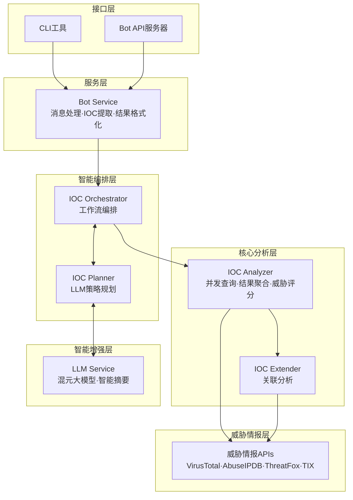
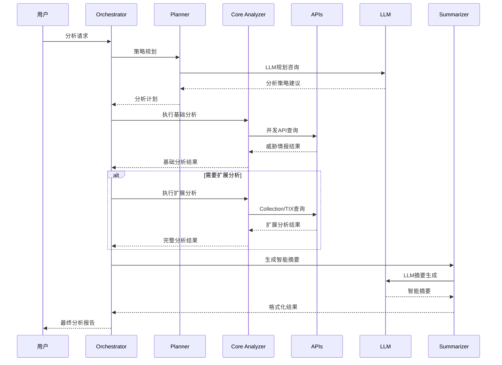
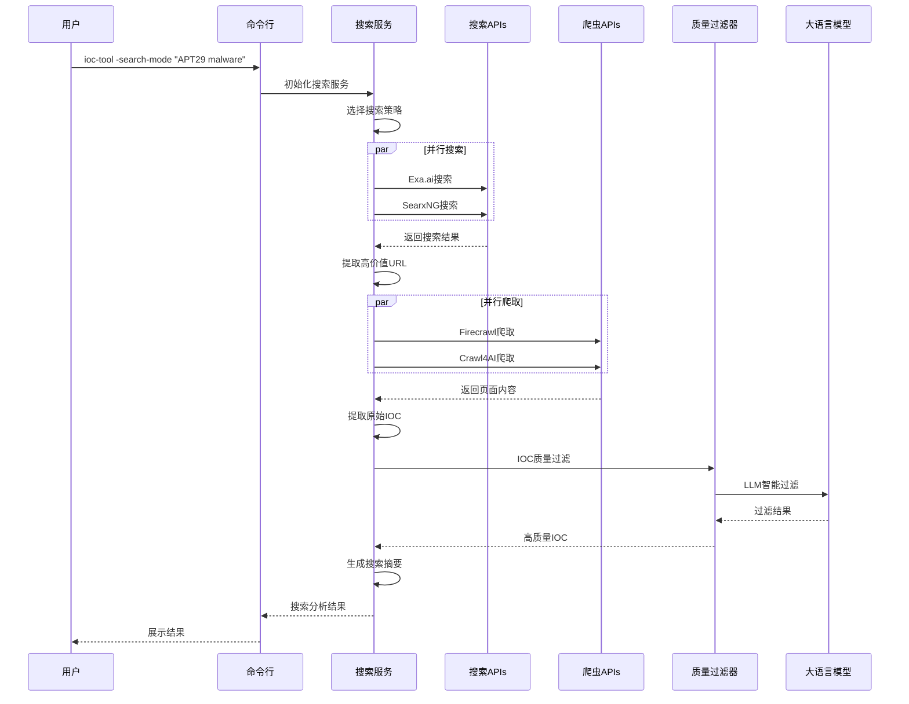
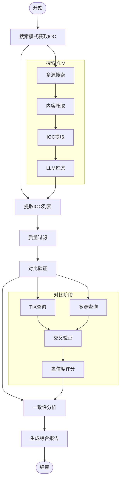
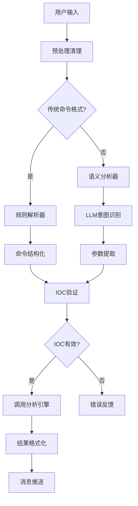
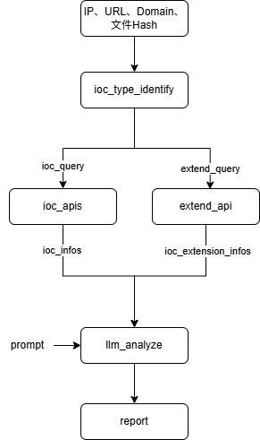
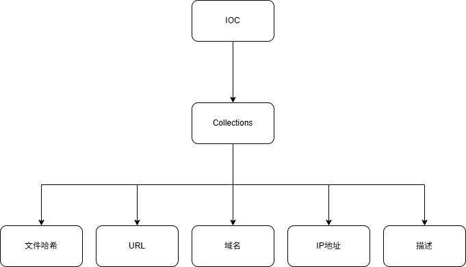
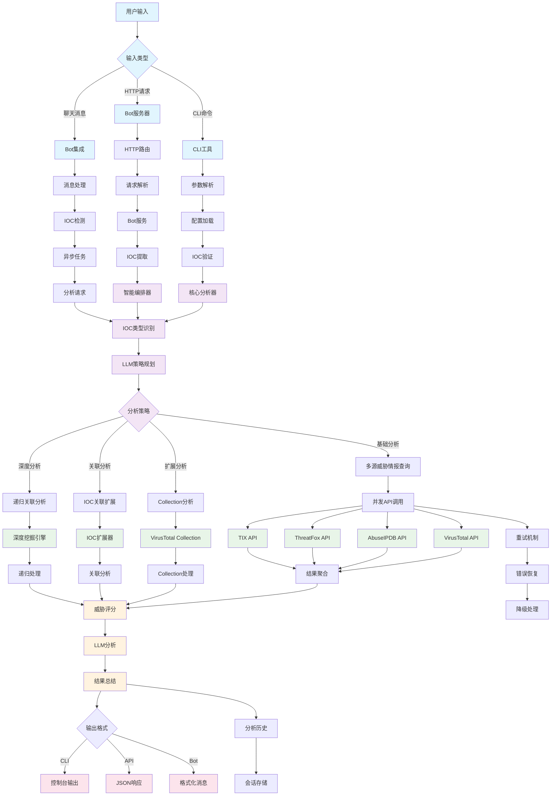
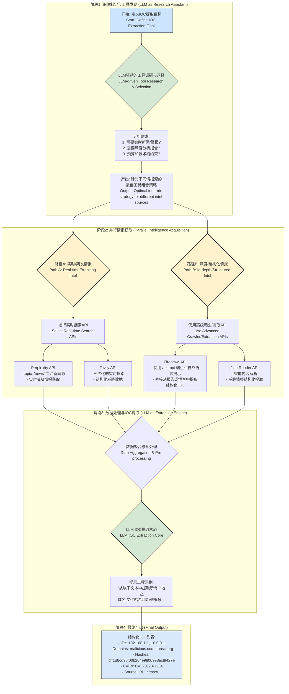

# Daily Study
## Daily Plan
#todo
- [x] 写博客
- [ ] 

##  IOC-Tool

整体架构

### 整体的工作流程

### 工具和API介绍

|服务名称 (Service)|支持的主要IOC类型|API限制|核心特点与数据源|
|---|---|---|---|
|**VirusTotal**|文件哈希, URL, 域名, IP地址|**Public API:** 500次/天, 4次/分钟 (需注册获取免费API Key)|**业界标杆。** 聚合了超过70个反病毒引擎和URL扫描服务的扫描结果，提供极其丰富的上下文信息。数据源为各大安全厂商和自身分析。|
|**ThreatFox (**[**abuse.ch**](http://abuse.ch)**)**|IP地址, 域名, URL, 文件哈希|**无明确限制，鼓励合理使用。** 明确表示可用于商业和非商业目的。|**专注于恶意软件IOC。** 由知名的非营利安全研究组织abuse.ch运营，提供高质量、可操作的与僵尸网络、勒索软件等相关的IOC。数据实时性强。|
|**AbuseIPDB**|IP地址|**1,000次/天** (需注册获取免费API Key)。通过验证域名或放置徽章可提升额度。|**IP信誉专家。** 完全由全球用户社区驱动，实时报告和查询与垃圾邮件、DDoS、黑客攻击等滥用行为相关的IP地址。数据直观，包含置信度评分。|
|**AlienVault OTX**|IP地址, 域名, 文件哈希 (MD5, SHA1, SHA256), URL, CVE|无明确的严格速率限制，但要求合理使用 (需注册获取免费API Key)。|社区驱动的威胁情报中心。 用户可以创建和订阅“Pulses”（威胁简报），将相关的IOC打包分享。数据源来自庞大的全球社区和AT&T Cybersecurity的研究。|
|Pulsedive|IP地址, 域名, URL|注册免费用户: 50次/天, 500次/月。未注册访客: 10次/天, 100次/月 (需注册获取免费API Key以获得更高额度)。|社区版威胁情报平台。 聚合开源情报(OSINT)源，并由社区用户提交和丰富数据。提供主动和被动扫描能力，界面友好，数据关联性强。|
|[URLScan.io](http://URLScan.io)|URL, 域名|公开扫描: 每天约100-200次。API查询: 注册后提供免费额度，未注册用户有更严格的限制。速率限制通过HTTP头返回。|网站扫描与分析利器。 对提交的URL进行深度分析，返回页面截图、DOM结构、外联请求、检测到的技术栈等详细信息。对于钓鱼网站和恶意跳转分析极为有用。|
|GreyNoise|IP地址|Community API: 50次查询/周 (网页和API共享额度)。需注册获取API Key。|“反向”威胁情报。 专注于识别和分类互联网背景“噪音”（如良性扫描器的扫描行为），帮助分析师忽略无关警报，聚焦于真正的定向攻击。对于区分扫描流量和恶意流量非常有价值。|
|CrowdSec Threat Intelligence|IP地址|免费套餐: 每月50次查询。|协作式网络安全。 其数据来源于庞大的CrowdSec代理网络。当一个代理检测到攻击时，该攻击者IP会被分享到中心，并分发给所有用户，形成群体免疫。|
|RST Cloud|IP地址, 域名, URL, 文件哈希|无独立的免费API套餐。 通常通过AWS、Google Cloud等云市场的免费套餐额度使用，定价为$0.002/请求。|多源聚合情报服务。 从沙箱、蜜罐和多个合作伙伴处聚合威胁情报，提供统一格式的查询结果。服务重点在于数据的丰富性和准确性。|

### 效果

| 对比维度     | 传统工具(TIX等) | IOC-Tool   | 优势描述           |
| -------- | ---------- | ---------- | -------------- |
| **查询方式** | 单一API查询    | 多源并发查询     | 4倍查询效率提升，结果更全面 |
| **分析深度** | 单点IOC信息    | 关联分析       | 从点到面的威胁情报升级    |
| **智能程度** | 预设规则查询     | LLM驱动的策略规划 | 动态分析策略，适应复杂场景  |
| **扩展能力** | 手工关联分析     | 自动IOC扩展发现  | 发现隐藏关联，重构攻击活动  |
| **结果质量** | 原始数据展示     | 智能摘要+威胁评分  | 专业威胁分析报告输出     |

#### 1. **LLM驱动的智能分析规划  **

```
传统方式: 用户 → 选择API → 手工查询 → 人工分析
IOC-Tool: 用户需求 → LLM规划 → 自动执行 → 智能摘要
```

**价值**: 将专家经验融入系统，普通用户也能获得专家级分析结果

#### 2. **多源威胁情报聚合引擎**

```
单一查询: VirusTotal(恶意:5/70) → 结论不明确
IOC-Tool聚合: VirusTotal(5/70) + AbuseIPDB(置信度:75%) + ThreatFox + TIX(威胁组织:APT28) → 综合威胁评分:85% + 威胁归属 + 建议措施
```

**价值**: 多维度验证，减少误报，提供可信的威胁评估

#### 3. **攻击链重构和关联分析**

```
传统查询: 单个IP → 基础威胁信息
IOC-Tool扩展: 单个IP → Collection关联 → 发现20个相关IOC → 重构攻击时间线  → 识别威胁组织 → 预测下一步攻击【后三步待优化】
```

**价值**: 从被动防御升级为主动威胁狩猎

#### 4. **三层分析策略的智能选择**

**基础分析 (2-5秒)**

- 适用场景: 快速威胁评估、日常安全运营
    
- 查询范围: 4个威胁情报源并发查询
    
- 输出结果: 恶意性判断 + 威胁等级 + 基础建议
    

**扩展分析 (10-30秒)**

- 适用场景: 安全事件调查、威胁溯源
    
- 分析深度: IOC关联 + Collection分析 + 威胁组织归属
    
- 输出结果: 关联IOC列表 + 攻击活动分析 + TTP映射
    

**深度分析 (30-120秒) [待优化]**

- 适用场景: APT调查、威胁情报研究
    
- 分析范围: 完整攻击链重构 + 历史活动分析 + 威胁演化
    
- 输出结果: 完整威胁画像 + 攻击趋势 + 防护建议
    

#### 应用场景1: 安全运营中心(SOC)日常工作

**传统方式**:

1. 收到告警包含可疑IP: 192.168.1.100
    
2. 分别查询VirusTotal、AbuseIPDB、ThreatFox
    
3. 手工整理查询结果，评估威胁等级
    
4. 编写分析报告，耗时30-60分钟
    

**IOC-Tool方式**:

1. 输入: "分析这个IP 192.168.1.100 的威胁情况"
    
2. 系统自动: LLM规划 → 并发查询 → 结果聚合 → 智能摘要
    
3. 3分钟内获得专业威胁分析报告
    
4. **效率提升**: 20倍效率提升，1人可完成原本5人的工作量
    

#### 应用场景2: 威胁情报分析师的深度调查

**传统方式**:

1. 发现恶意域名: [evil.com](http://evil.com)
    
2. 手工查询各个平台，收集相关IOC
    
3. 绘制攻击链，分析威胁组织
    
4. 整个过程需要2-4小时
    

**IOC-Tool深度分析**:

1. 输入: "深度分析域名 [evil.com](http://evil.com)，包括关联分析和威胁组织归属"
    
2. 系统执行: Collection扩展 → 发现50个关联IOC → TIX威胁组织查询 → 攻击链重构
    
3. 15分钟内完成完整威胁情报报告
    
4. **质量提升**: 发现人工分析可能遗漏的关联IOC和攻击模式
    

#### 应用场景3: 聊天机器人集成的自动化分析

**传统方式**: 无法实现，需要专业人员手工操作

**IOC-Tool实现**:

```
用户: "这个哈希 d41d8cd98f00b204e9800998ecf8427e 安全吗？"
Bot: "正在为您分析文件哈希..."
     3秒后返回专业分析报告，包括:
     - 威胁等级: 良性文件
     - 检测结果: 0/70 引擎报毒
     - 文件信息: 空文件(0字节)
     - 安全建议: 可以安全使用
```

#### 量化性能对比

|性能指标|传统单一查询|IOC-Tool|提升倍数|
|---|---|---|---|
|**查询速度**|10-30秒/API|3-5秒并发|6-10倍|
|**数据覆盖**|单一数据源|4个主要平台|4倍|
|**分析深度**|基础信息|关联+攻击链|质的飞跃|
|**专业度**|原始数据|专家级报告|10倍|
|**集成成本**|数周开发|5分钟配置|500倍|

## IOC-Search

### Search的流程

### Search->Comparison的流程和效果

### **工具和API介绍**

|服务名称 (Service)|API限制|核心特点与数据源|主要功能|
|---|---|---|---|
|[**Exa.ai**](http://Exa.ai)|1000次|AI搜索|AI原生搜索，其架构基于LangGraph构建，采用“规划器-任务-观察者”（Planner-Task-Observer）模式，从一个简单的搜索API演进为一个多智能体研究系统。|
|**Firecrawl**|500次|AI爬虫|Firecrawl的核心架构目标是成为一个数据转换管道。它接收一个URL作为输入，并输出纯净、结构化的数据，同时处理了网络爬取过程中的各种复杂性 。它利用AI驱动的技术智能地将主要内容与样板文件（如导航栏、页脚）区分开，将混乱的HTML转换为纯净的Markdown或结构化JSON|
|Crawl4AI|开源|开源AI爬虫|Crawl4AI基于Python构建，并使用Playwright进行强大、现代的浏览器自动化，使其能够有效处理大量使用JavaScript的网站 。其架构是模块化和高度可配置的，对浏览器和爬取本身提供了精细的控制。|
|SearxNG|开源|开源搜索聚合|主要功能是在众多可配置的类别（网页、图片、新闻、科学等）中进行联合搜索 。它通过单个它通过单个  settings.yml文件进行高度定制，管理员可以在其中启用/禁用引擎、配置代理、设置速率限制和定义输出格式 。它可以输出标准HTML格式的结果，以及机器可读的格式，如 JSON、CSV和RSS。|

### 效果对比

执行 `./ioc-tool -search-mode "APT29"` ，这里llm过滤400个的成本为0.02元，差不多2万token。


经过对比之后的生成的CSV表格

## IOC-Bot

相较于IOC-TOOL，增加了基于LLM的语义分析，对用户的输入进行意图识别，判断应当采用哪种IOC分析策略。

## Tencent自研与VirusTotal的对比

### Tencent TI

链接：

- [https://tix.qq.com/apinterface/overview](https://tix.qq.com/apinterface/overview) 文档
    
- [https://tix.qq.com](https://tix.qq.com) 入口
    

#### 核心方法

腾讯TI的核心方法论是**自产**。其情报主要来源于对自身庞大生态系统的深度监控和分析。

1. **自有数据源：** 情报根植于腾讯的业务生态，包括但不限于：
    
    - **社交网络：** 微信、QQ上的链接和文件传播分析。
        
    - **云服务：** 腾讯云上的网络流量、主机行为和存储数据。
        
    - **终端安全：** 腾讯电脑管家、手机管家等终端产品的威胁检测数据。
        
    - **网络流量：** 覆盖全国的DNS解析和网络流量数据。
        
2. **深度研判与关联：** 腾讯TI不仅仅是收集数据，更强调内部安全专家的研判。他们会将分离的IOCs与特定的攻击活动、攻击组织（APT团伙）进行关联，形成更完整的攻击链条画像。
    
3. **本地化信息增强：** 它会利用其独特的资源，为IOC增加本地化上下文，例如一个恶意域名关联的**ICP备案信息**（网站主办方、性质等），这是全球性平台无法提供的。
    

#### IOC关联能力

关联主要能力基于其内部数据的深度和高质量。

- **内部数据闭环：** 在腾讯的生态系统内，一个IP、一个域名、一个文件哈希、一个QQ号或微信号的关联关系可能早已被其后台大数据平台所捕捉和分析。例如，他们可以分析出某个恶意域名是通过哪类钓鱼邮件在QQ群中传播的。
    
- **基于攻击者画像的关联：** 腾讯TI的核心是将孤立的IOCs归因到特定的攻击组织。它的关联逻辑是“自上而下”的：平台已经通过深度研究掌握了某个APT团伙（如Lazarus）的常用工具库和基础设施模式。当一个新的IOC被发现时，腾讯的系统会判断它是否符合已知团伙的“模式”，如果符合，就会将其自动关联到该团伙，并由此链接到该团伙的其他已知IOCs。
    

#### 关系图的绘制能力

它的“关系图”体现在其API返回的JSON数据结构中。

1. **文本化的关系：** 当你查询一个IOC时，返回的数据会包含一些字段来描述其关联性。例如，查询一个IP地址，返回的JSON中可能会包含：
    
    - 一个threat_actor字段，直接告诉你这个IP属于“APT-C-38”。
        
    - 一个malware_family字段，告诉你这个IP关联的恶意软件是“FakeSpy”。
        
    - 一个related_domains数组，列出与此IP关联的其他恶意域名。
        
2. **用户自行绘制：** 用户获取到这些结构化的关联数据后，如果需要可视化，必须将数据导入到自己的SIEM平台、威胁情报平台（TIP）或专门的可视化工具（如Maltego）中，才能自行绘制出关系图谱。
    

### VriusTotal

#### 核心方法

VirusTotal的核心方法论是**聚合**。它本身不“生产”原始情报，而是像一个情报领域的“联合国”，汇集了全球的力量。

1. **多引擎扫描：** 这是其最核心的方法。当你提交一个文件哈希或URL时，VirusTotal会将其分发给**全球超过70家主流安全厂商**（如卡巴斯基、赛门铁克、迈克菲等）的扫描引擎进行同步检测。它收集所有厂商的判断结果（如“恶意”、“干净”、“未知”），并将其展示给你。
    
2. **众包数据：** 其庞大的数据库来源于全球数百万用户和安全研究人员的日常提交。任何人都可以在其网站上提交可疑文件和URL，这些提交的数据极大地丰富了其IOC库。
    
3. **被动DNS复制：** 通过分析全球DNS解析记录，VirusTotal能够构建出域名和IP地址之间的历史关系图谱，帮助分析人员追溯恶意设施的演变。
    

#### IOC关联能力

VirusTotal的扩展能力基于其多种数据维度，可以参照下方的**IOC富化API表格**：

- **被动DNS (Passive DNS):** 这是最基础也是最强大的关联方法。
    
    - **IP → 域名：** 输入一个IP地址，VT可以返回历史上所有解析到该IP的域名列表。
        
    - **域名 → IP：** 输入一个域名，VT可以返回该域名历史上解析过的所有IP地址。
        
- **文件行为分析 (Sandbox Detonation):**
    
    - **文件 → 网络IOCs：** 分析文件在沙箱中执行的行为报告，可以提取其通信的IP和域名（C2服务器）、访问的URL、下载的后续文件等。
        
    - **URL → 文件：** 输入一个URL，可以反向查询有哪些文件是从该URL下载的。
        
- **结构化内容关联：**
    
    - **文件 → 文件：** 通过imphash、vhash、ssdeep等“模糊哈希”算法，可以找出功能上相似、可能是同源变种的其他恶意软件样本，即使它们的MD5/SHA256完全不同。
        
    - **URL → URL：** 可以找出结构相似或重定向到相同最终页面的其他恶意URL。
        

#### **关系图的绘制能力 (VirusTotal Graph)**

这是VirusTotal付费高级功能。

1. **可视化画布：** 它提供一个交互式的图形界面。分析师可以将任何一个IOC（如一个IP地址）作为初始节点拖入画布。
    
2. **一键扩展：** 右键点击该节点，VT会提供一个扩展菜单，包含了上述所有的关联关系（如“解析到此IP的域名”、“与此IP通信的文件”等）。
    
3. **递归探索：** 分析师可以点击选择一个关系进行扩展，新的IOCs节点和代表它们之间关系的“边”会自动添加到画布上。分析师可以对新节点进行无限制的递归扩展，逐步构建出一个庞大的攻击基础设施和恶意软件家族的关系图谱。
    
4. **直观理解：** 通过这种可视化方式，分析师可以非常直观地识别出攻击活动的核心节点（如关键的C2服务器）、发现未知的恶意软件样本、并完整地勾勒出整个攻击的全貌。
    

## IOC-Tool工具

当前工具分析单个IOC("24d004a104d4d54034dbcffc2a4b19a11f39008a575aa614ea04703480b1022c", "WannaCry勒索软件 ")的效果：  

### IOC-Tool查找、富化与大模型分析的简单流程

### IOC查找的API

|服务名称 (Service)|支持的主要IOC类型|免费API限制|核心特点与数据源|
|---|---|---|---|
|**VirusTotal**|文件哈希, URL, 域名, IP地址|**Public API:** 500次/天, 4次/分钟 (需注册获取免费API Key)|**业界标杆。** 聚合了超过70个反病毒引擎和URL扫描服务的扫描结果，提供极其丰富的上下文信息。数据源为各大安全厂商和自身分析。|
|**AbuseIPDB**|IP地址|**1,000次/天** (需注册获取免费API Key)。通过验证域名或放置徽章可提升额度。|**IP信誉专家。** 完全由全球用户社区驱动，实时报告和查询与垃圾邮件、DDoS、黑客攻击等滥用行为相关的IP地址。数据直观，包含置信度评分。|
|**AlienVault OTX**|IP地址, 域名, 文件哈希 (MD5, SHA1, SHA256), URL, CVE|**无明确的严格速率限制**，但要求合理使用 (需注册获取免费API Key)。|**社区驱动的威胁情报中心。** 用户可以创建和订阅“Pulses”（威胁简报），将相关的IOC打包分享。数据源来自庞大的全球社区和AT&T Cybersecurity的研究。|
|**Pulsedive**|IP地址, 域名, URL|**注册免费用户:** 50次/天, 500次/月。**未注册访客:** 10次/天, 100次/月 (需注册获取免费API Key以获得更高额度)。|**社区版威胁情报平台。** 聚合开源情报(OSINT)源，并由社区用户提交和丰富数据。提供主动和被动扫描能力，界面友好，数据关联性强。|
|**ThreatFox (**[**abuse.ch**](http://abuse.ch)**)**|IP地址, 域名, URL, 文件哈希|**无明确限制，鼓励合理使用。** 明确表示可用于商业和非商业目的。|**专注于恶意软件IOC。** 由知名的非营利安全研究组织abuse.ch运营，提供高质量、可操作的与僵尸网络、勒索软件等相关的IOC。数据实时性强。|
|[**URLScan.io**](http://URLScan.io)|URL, 域名|**公开扫描:** 每天约100-200次。**API查询:** 注册后提供免费额度，未注册用户有更严格的限制。速率限制通过HTTP头返回。|**网站扫描与分析利器。** 对提交的URL进行深度分析，返回页面截图、DOM结构、外联请求、检测到的技术栈等详细信息。对于钓鱼网站和恶意跳转分析极为有用。|
|**GreyNoise**|IP地址|**Community API:** 50次查询/周 (网页和API共享额度)。需注册获取API Key。|**“反向”威胁情报。** 专注于识别和分类互联网背景“噪音”（如良性扫描器的扫描行为），帮助分析师忽略无关警报，聚焦于真正的定向攻击。对于区分扫描流量和恶意流量非常有价值。|
|**CrowdSec Threat Intelligence**|IP地址|**免费套餐:** 每月50次查询。|**协作式网络安全。** 其数据来源于庞大的CrowdSec代理网络。当一个代理检测到攻击时，该攻击者IP会被分享到中心，并分发给所有用户，形成群体免疫。|
|**RST Cloud**|IP地址, 域名, URL, 文件哈希|**无独立的免费API套餐。** 通常通过AWS、Google Cloud等云市场的免费套餐额度使用，定价为$0.002/请求。|**多源聚合情报服务。** 从沙箱、蜜罐和多个合作伙伴处聚合威胁情报，提供统一格式的查询结果。服务重点在于数据的丰富性和准确性。|

### IOC类型

主要是根据上方的查找API支持的IOC类型制定能够查询的IOC

- IP地址
    
- 文件哈希
    
- URL
    
- 域名
    

### IOC扩展API

目前主要使用**VirusTotal API** 来获得与原先IOC关联的更多的IOC信息，其API调用限制如下

|   |   |
|---|---|
|Request rate|4 lookups / min|
|Daily quota|500 lookups / day|
|Monthly quota|15.5 K lookups / month|

其API具体说明如下，可以从给定的 IP、File、URL、Domain 元IOC信息查找到与其关联的IOC信息

|主对象类型|关系名称|描述|返回对象类型|访问层级|API|
|---|---|---|---|---|---|
|**文件 (File)**|behaviours|文件在沙箱中的动态行为报告|FileBehaviour 集合|高级||
||contacted_domains|文件执行时联系的域名|Domain 集合|公共||
||contacted_ips|文件执行时联系的 IP 地址|IPAddress 集合|公共||
||dropped_files|文件执行时释放的文件|File 集合|高级||
||similar_files|基于多种算法找到的相似文件|File 集合|公共||
||comments|社区对该文件的评论|Comment 集合|公共||
||graphs|包含此文件的 VT 图谱|Graph 集合|公共||
|**URL**|downloaded_files|从该 URL 下载的文件|File 集合|公共||
||last_serving_ip_address|该 URL 最后提供服务的 IP 地址|IPAddress|公共||
||redirecting_urls|重定向到此 URL 的其他 URL|URL 集合|公共||
||network_location|URL 的网络位置信息|Resolution|公共||
|**域名 (Domain)**|resolutions|该域名历史解析到的 IP 地址|Resolution 集合|公共||
||siblings|与该域名共享 IP 的“兄弟”域名|Domain 集合|公共||
||subdomains|该域名的子域名|Domain 集合|公共||
||urls|属于该域名的 URL|URL 集合|公共||
||historical_whois|历史 Whois 记录|Whois 集合|公共||
||historical_ssl_certificates|历史 SSL 证书记录|SSLCertificate 集合|公共||
|**IP 地址 (IP Address)**|resolutions|解析到该 IP 的域名|Resolution 集合|公共|/ip_addresses/{ip}/resolutions|
||communicating_files|与该 IP 通信的文件|File 集合|公共|/ip_addresses/{ip}/communicating_files|
||downloaded_files|从该IP下载的文件|403|高级|/ip_addresses/{ip}/downloaded_files|
||urls|托管在该 IP 上的 URL|URL 集合|高级|/ip_addresses/{ip}/urls|
||historical_ssl_certificates|历史IP的SSL证书|SSLCertificate 集合|公共|/ip_addresses/{ip}/historical_ssl_certificates|
||historical_whois|历史 Whois 记录|Whois 集合|公共|/ip_addresses/{ip}/historical_ssl_certificates|
|**集合(Collection)**|{ioc_type}/{ioc_id}/collections|根据一个已知的 IOC，反向查询它被包含在了哪些 Collection 中|Collection集合|公共|/{ioc_type}/{ioc_id}/collections|
||relationship|列出指定 Collection 中包含的特定类型的所有 IOC|IOC_type集合|公共|/api/v3/collections/{id}/{relationship}|

访问层级中的“高级”通常指需要 VirusTotal 企业版（VT Enterprise）或特定付费许可证的 API 密钥。

#### 使用Collection进行Extend

IOC_extend 的逻辑如下：

1. 给定一个IOC，反向查询到所有包含该IOC的Collections
    
2. 遍历Collections中的每一个Collection（其包含内容如上图所示），对其包含的IOC进行分析
    
3. 找到时间最新的具有威胁的IOC信息进行返回
    

使用IOC_extend测试单个IOC("24d004a104d4d54034dbcffc2a4b19a11f39008a575aa614ea04703480b1022c", "WannaCry勒索软件 ")，要65次调用。

### IOC Go版本 v2.0.0



把之前的Python版本改为Go版本


### IOC-Search

当前运行结果

#### 整体思路

## 威胁情报开源项目调研

目前看了两个可以利用的开源项目，集中在利用大模型进IOC的提取，然后进行结构化的输出

### TTPMapper

链接：[https://github.com/infosecn1nja/TTPMapper](https://github.com/infosecn1nja/TTPMapper)

#### 核心思路

主要用于将网络上的非结构化威胁情报报告（比如 PDF 或网页）自动化转换为结构化的数据，便于安全分析和集成。

- **AI 自动抽取**：利用大语言模型自动理解报告内容，提取关键信息，极大提升威胁情报自动化处理能力。
    
- **标准化结构**：输出数据严格按 MITRE ATT&CK 和 STIX 2.1 标准组织，方便安全平台自动对接和分析。
    
- **用户友好**：支持 PDF/网页一键处理，自动生成摘要、标题。
    

---

#### **详细工作流程**

1. **输入报告**
    
    - 用户可以通过命令行参数指定 PDF 文件路径或威胁情报报告的网页 URL。
        
    - 示例：
        
        ```
        python3 main.py --pdf "report.pdf" --output json
        python3 main.py --url "<https://xxx.com/report"> --output stix21
        ```
        
2. **报告内容提取与预处理**
    
    - core/report_parser.py 提供了 fetch_and_convert_report、extract_text_from_pdf 等方法，自动将网页内容或 PDF 文本提取并转为 Markdown 格式，便于后续解析。
        
3. **AI 驱动的信息抽取**
    
    - 利用 DeepSeek LLM（大模型）进行文本解析，抽取出：
        
        - MITRE ATT&CK 技术（TTPs）：攻击技术编号、名称、战术、描述等。
            
        - IOC（威胁指标）：IP、域名、URL、HASH、CVE等。
            
        - 威胁行为者（如 APT28、LockBit 等）。
            
        - 总结与报告标题（自动生成简要摘要和专业标题）。
            
    - 相关代码在 core/deepseek_client.py，如 summarize() 和 generate_title() 方法。
        
4. **结构化输出**
    
    - 抽取的数据可导出为两种格式：
        
        - json：标准结构化 JSON。
            
        - stix21：STIX 2.1 标准（适合 CTI 平台集成）。
            
    - STIX 化的核心逻辑见 core/ttp_mapper.py 的 generate_stix_bundle() 方法，自动生成 STIX 对象并建立关系（如攻击者使用某技术、某 IOC 指示某攻击者等）。
        
5. **结果保存**
    
    - 将分析结果保存到本地文件，输出路径和格式由参数指定。
        

### TTP-Threat-Feeds

链接：[https://github.com/bobby-tablez/TTP-Threat-Feeds](https://github.com/bobby-tablez/TTP-Threat-Feeds)

#### 核心思路

TTP-Threat-Feeds 的目标是**自动化地从安全研究报告中提取威胁行为（TTPs）和 IOC（威胁情报指标）**，并生成结构化的 YAML 文件，帮助检测工程师和威胁研究员快速获得检测机会和关联分析逻辑。

- 自动抓取并解析全球权威安全厂商和博客的最新威胁情报报告（以 urls.txt 维护源列表）。
    
- 利用 OCR 技术对报告中的图片进行文本提取，确保不会遗漏截图中的关键命令或 TTP。
    
- 利用本地部署的大语言模型（LLM），通过特制 prompt 对报告进行结构化提取。
    
- 输出高度结构化、易读、便于后续分析的 YAML 文件（按时间、来源、家族等归档）。
    

---

#### 详细工作流程

1. **抓取源站点内容**
    
    - 项目通过读取 urls.txt 中维护的大量安全情报博客 URL。
        
    - 对每个源站点，提取主页或 RSS 流中的最新文章链接。
        
2. **提取单篇文章内容**
    
    - 对每篇新文章，抓取全文 HTML 内容。
        
    - 若包含图片，利用 pytesseract OCR 抽取图片中的文本（如截图中的命令行）。
        
3. **内容拼接与分段**
    
    - 将文章正文和图片文本合并。
        
    - 为防止文本过长导致 LLM 处理失败，自动分块处理。
        
4. **大语言模型结构化抽取**
    
    - 通过专用 prompt，调用本地 LLM（如 Qwen、Gemma），让模型从原文中提取：
        
        - 简要描述
            
        - 归因（攻击者、APT、国家等）
            
        - 恶意家族
            
        - MITRE ATT&CK 技术
            
        - 关键命令、进程树、持久化、横向移动等详细 TTP 数据
            
        - IOC（IP、域名、哈希、URL 等）
            
    - 只保留报告原文中明确定义的数据，避免模型“编造”。
        
5. **YAML 输出与归档**
    
    - 合并所有分块的结构化结果，补充元数据（如时间、来源、家族）。
        
    - 以 YAML 文件保存，归档到 results/年/月/ 目录下，文件名包含时间戳、来源域名、家族名。
        

## 大模型爬虫工具调研

|   |   |   |   |   |   |
|---|---|---|---|---|---|
|**工具**|**架构**|**动态内容处理**|**LLM特定功能**|**部署模型**|**最适合**|
|**Playwright**|浏览器自动化框架|完整的浏览器上下文、自动等待、高保真交互|不适用（基础技术）|库/自托管|最大化控制权，构建复杂的、需要精细交互的代理任务|
|**Firecrawl**|托管API服务|通过API管理的“动作”、智能等待|基于提示的/extract、LLM就绪的Markdown|云API|快速开发，将爬取的复杂性外包，按需付费|
|**Crawl4AI**|开源库|可配置的JS执行、会话管理|可选的LLM/非LLM提取策略、为RAG优化的Markdown|库/自托管|构建需要高度控制和定制化的自有爬虫流水线|
|**fetcher-mcp**|开源协议服务器|基于Playwright|Readability.js智能内容提取|本地服务器/自托管|为本地或桌面LLM应用提供标准化的Web访问接口|

### 基础技术：Playwright

微软的，现在新的 LLM 爬虫工具基本都是基于Playwright来处理网页信息，还是使用无头浏览器，有如下优点：

- **进程外执行：** Playwright与现代浏览器架构保持一致，在独立的进程中运行测试，避免了进程内测试运行器的诸多限制。
    
- **浏览器上下文：** 它为每个任务创建一个全新的“浏览器上下文”，这相当于一个全新的、隔离的浏览器配置文件。这提供了完全的测试隔离，且开销极小。
    
- **自动等待：** 在执行点击或输入等操作前，Playwright会自动等待目标元素变为可操作状态，从而消除了因页面加载延迟而导致测试失败的主要原因——硬编码的等待时间。
    
- **Web优先断言：** 其断言机制专为动态Web设计，会自动重试检查，直到满足必要的条件。
    

### Firecrawl

这个挺好的！

Firecrawl是一个托管的API服务，它将网络爬虫和抓取的复杂性完全抽象化，旨在为AI应用提供干净的数据 。它提供了一套功能丰富的API端点，包括  /scrape（单页抓取）、/crawl（整站爬取）、/map（获取站点地图）、/search（搜索并抓取）和/extract（AI驱动的结构化数据提取）。  

/extract端点上。开发者无需编写CSS选择器或XPath，只需提供一个自然语言提示（Prompt），描述他们想要提取的数据，Firecrawl便会利用LLM来理解提示并返回结构化的JSON数据 。

### Crawl4AI

这是一个基于Playwright的开源、LLM友好型爬虫库 。其关键特性是为开发者提供了在传统高效提取（CSS/XPath）和灵活语义的LLM驱动提取之间的选择权 。它提供了对爬取过程的深度控制，包括深度优先（DFS）、广度优先（BFS）等爬行策略，以及精细的会话管理功能 。

该方法的核心是一个评分器，它基于数据过滤模型的思想，来评估一个给定的网页对于提升LLM在下游任务上性能的“影响力”。爬虫随后会优先访问和抓取那些得分最高的URL

Crawl4AI是一个功能全面、特性丰富的库，面向那些希望构建和控制自己复杂爬取流水线的开发者。

### fetcher-mcp

使用Playwright来获取和解析网页内容 。它的设计定位是一个LLM应用（如其示例中提到的“Claude for Desktop”）的“边车（sidecar）”工具，通过一个标准化的协议提供Web访问能力 。它内置了Readability算法，能智能地提取页面的主要内容，去除广告和导航等无关元素 。

fetcher-mcp更关注抽象和标准化。“模型上下文协议”这一概念旨在为LLM请求网络数据创建一个简单、可互操作的接口，将实现细节隐藏起来。

### BardeenAgent

提出了一种混合方法：代理在观察单个示例后，学习生成一个可泛化的CSS选择器，从而将LLM的智能与传统方法的效率结合起来

## 大模型搜索工具调研

|   |   |   |   |   |   |   |
|---|---|---|---|---|---|---|
|**服务**|**核心理念**|**特点**|**优势**|**搜索功能**|**引用处理**|**定价模型**|
|**Google Grounding**|全托管与集成|谷歌Gemini API的一项原生功能，可将模型无缝连接到实时网络内容|声称其系统“每分钟都会抓取新的URL”，以确保信息的新鲜度 。其API架构专为AI代理设计，提供/search（快速查找）和 /research（代理式深度研究）等不同层次的端点 。|自动溯源、模型驱动的搜索与引用|结构化的groundingMetadata，支持内联引用|按启用工具的API请求计费|
|[**Exa.ai**](http://Exa.ai)|面向代理的语义引擎|一个为AI设计的现代语义搜索引擎，旨在理解查询意图而非简单的关键词匹配 。|提供专门的 Live News API，可实现“实时新闻搜索（在新闻发生后数分钟内）” ，非常适合捕获突发威胁情报。其API返回“异常长的摘要（uniquely long snippets）”，为LLM提供更丰富的上下文 。|代理式研究API、语义相似度搜索、Websets|标准URL列表|按每1000次调用计费|
|**Tavily AI**|开发者高度控制|专为AI代理和LLM构建的搜索引擎，强调实时、准确和事实性结果|提供高度的开发者控制权。通过 time_range 参数可将搜索精确到“天”、“周”等时间范围。search_depth 参数允许在成本和信息深度之间进行权衡（“basic”搜索成本较低，“advanced”搜索成本较高。|search_depth、include_answer、include_raw_content、域名过滤|可选的综合答案和原始HTML内容|基于积分，不同深度搜索成本不同|
|**Perplexity AI**|对话式答案引擎|一个对话式的“答案引擎”，实时从网络中整合并编译来自多个来源的信息 。|将搜索、提取和总结融为一体，能快速对一个复杂的威胁事件进行研究，并获得一个经过提炼、带引用的综合性摘要 。其“Pro Search”模式可进行更深入的搜索，并提供更多信源。|Pro Search、多模态输入（文件/图片）、深度研究模型|综合性答案，带引用链接|基于Token用量计费|
|[**You.com**](http://You.com)|实时信息与长摘要|专为提供最新、最真实信息而设计的答案引擎|提供专门的 Live News API，可实现“实时新闻搜索（在新闻发生后数分钟内）” ，非常适合捕获突发威胁情报。其API返回“异常长的摘要（uniquely long snippets）”，为LLM提供更丰富的上下文 。|Research API、Smart API、长摘要|异常长的摘要以增强上下文|按月度调用量分级计费|
|**SerpApi**||通过实时抓取主流搜索引擎（如谷歌）的结果页来提供结构化JSON数据 。|保证获取到的是用户在浏览器中看到的真实实时结果 。支持抓取谷歌新闻、谷歌学术等多个垂直领域，对于全面收集不同类型的威胁情报（如技术论文、新闻报道）非常有用 。||||

### [**You.com**](http://You.com)

提供专门的 Live News API，可实现“实时新闻搜索（在新闻发生后数分钟内），非常适合捕获突发威胁情报。其API返回“异常长的摘要（uniquely long snippets）”，为LLM提供更丰富的上下文 。

### [Exa.ai](http://Exa.ai)

Exa明确其目标是服务于LLM用例，例如生成带有精确引用的摘要，以及发现传统搜索引擎难以找到的利基结果

**API架构与LLM特定功能：** Exa的API架构体现了对AI代理工作流的深刻理解。它提供了一个分层的API结构，反映了不同层次的代理能力 ：  

- /search: 一个低延迟、高效率的API，用于快速拉取高质量信息，是标准RAG应用的基础。
    
- /contents: 用于抓取指定URL网页内容的端点。
    
- /answer: 提供快速的、基于网络信息的直接答案。
    
- /research: 一个“代理式API（Agentic API）”，它会持续进行研究，直到输出正确的答案或报告。这个端点是为复杂的、需要深度研究的信息请求而设计的，可以看作是构建自主代理的原子操作 。  一个简单的RAG应用可能会使用/search，而一个负责撰写市场分析报告的复杂代理则会调用/research。这体现了对构建代理式工作流的AI开发者需求的成熟理解。
    

### Tavily AI

Tavily AI是一个专为AI代理和LLM构建的搜索引擎，其设计哲学与谷歌的“黑盒”方法截然相反，它将控制权交还给开发者。

**API参数与控制力：** Tavily的API提供了极为丰富的参数集，允许开发者精细地定制搜索过程，从而优化传递给LLM的信息负载 。关键参数包括：  

- max_results: 控制返回结果的数量。
    
- search_depth: 提供“basic”和“advanced”两种搜索深度选项。“basic”搜索速度快、成本低，而“advanced”搜索则会进行更深入的内容分析和筛选，提供更相关的摘要，但成本更高。
    
- include_answer: 在结果中包含一个由Tavily生成的综合性答案。
    
- include_raw_content: 在结果中包含每个网页的原始、已清理的HTML内容。
    
- include_domains / exclude_domains: 允许开发者指定或排除特定的搜索域。
    

### Grok

[https://linux.do/t/topic/667600](https://linux.do/t/topic/667600)

### SerpApi

SerpApi核心功能并非自己建立索引，而是实时抓取并解析主流搜索引擎（如谷歌、必应、百度等）的结果页，然后以结构化的JSON格式返回给用户。

### SearxNG

免费、开源、可自托管的_元搜索_引擎。它本身不拥有任何网络索引，而是通过聚合多达249个其他搜索服务的结果来工作 。

SearxNG的核心优势在于它提供了终极的控制权和隐私保护。通过自托管实例，用户可以完全控制其基础设施、日志记录，以及最关键的——用于生成搜索结果的搜索引擎组合 。开发者可以根据自己的需求，将谷歌等主要搜索引擎的结果与来自特定学术、技术或新闻来源的结果进行混合，创建一个高度定制化的信息流。

### Open-WebSearch MCP

链接：[https://github.com/Aas-ee/open-webSearch](https://github.com/Aas-ee/open-webSearch)

项目亮点一览

多引擎实时搜索

- 支持 Bing、百度、CSDN（目前 linux.do 暂不支持）
    
- 新增 DuckDuckGo、Exa、Brave
    
- 支持HTTP代理配置，轻松解决网络访问限制
    
- 可自定义默认搜索引擎
    
- 可配置引擎组合搜索，获取更全面的内容
    

流式响应（MCP协议）

- 完美兼容 Claude 插件（MCP）协议
    
- 更新为支持 streamableHttp 和 SSE 两种方式返回搜索结果，体验丝滑流畅
    

文章正文抓取

- 支持提取 CSDN 博客文章全文
    
- 支持提取 Linux.do（开发中）
    

完全免费 & 无需 API Key

- 不再依赖 Bing API / Google Custom Search
    
- 可自托管，无额度限制，数据可控
    

Docker 一键部署

- 提供 docker-compose 和镜像：Package open-web-search · GitHub
    

**Brave Search:** Brave Search由Brave软件公司开发，它运行在自己独立的网络索引之上。据其官方所述，该索引“有意地比谷歌或必应的索引小”，目的是为了减少垃圾邮件和其他低质量内容，其代价是在处理长尾查询方面可能不如谷歌 。Brave提供了一个正式的API，供开发者集成

**DuckDuckGo:** DuckDuckGo以其对用户隐私的保护而闻名，但它并未提供官方的公共API供开发者使用。因此，对其搜索结果的访问主要通过第三方的、非官方的抓取库实现，例如GitHub上的duckduckgo-search项目 和  duckduckpy 。这些库的文档通常会提示，由于其非官方性质，可能需要使用代理服务器等变通方法来避免被封禁，这表明其连接可能是脆弱和不稳定的 。

三个模块：

- 记忆模块
    
- 规划模块
    
- 行动模块