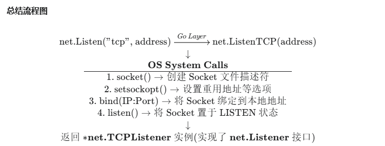

# Daily Study
## Daily Plan
#todo
- [x] 写博客
- [x] go/net ✅ 2025-09-28
## go中net包对于IP地址的转换过程
#go 

###  将ip地址转换为32位的无符号整数(uint32)

```go
package main

import (
	"encoding/binary"
	"fmt"
	"net"
)

// IPToUint32 将 IPv4 地址字符串转换为 uint32
func IPToUint32(ipStr string) (uint32, error) {
	// 1. 解析 IP 地址字符串
	ip := net.ParseIP(ipStr) //返回一个[]byte 切片
	if ip == nil {
		return 0, fmt.Errorf("invalid IP address format: %s", ipStr)
	}

	// 2. 获取 IPv4 地址的字节表示（4字节）
	// 注意：net.ParseIP 返回的是 16 字节的 IPv6 结构，
	// 对于 IPv4，其前 12 字节为零，我们需要取最后 4 字节。
	ip = ip.To4()
	if ip == nil {
		return 0, fmt.Errorf("IP address is not a valid IPv4 address: %s", ipStr)
	}

	// 3. 将 4 字节的切片转换为 uint32
	// 使用 binary.BigEndian (大端序) 或 LittleEndian (小端序) 来组合字节
	// 常见的网络字节序是 BigEndian。
	ipInt := binary.BigEndian.Uint32(ip)

	return ipInt, nil
}


```

### socket api 的格式
- **地址格式 (Address Structure)**：用于存储网络地址和端口号。
    
- **数据格式 (Data Flow)**：Socket 传输的实际数据流或数据报的格式。

#### 地址格式
Socket 在创建、绑定、连接时，必须知道通信另一端的地址信息，这些信息被封装在特定的 C 语言结构体中。最基本的通用结构是 `struct sockaddr`，包括ipv4和ipv6两种

IPv4 地址结构：`struct sockaddr_in`

用于 **AF_INET** (IPv4) 地址族。

|字段|类型|描述|
|---|---|---|
|`sin_family`|`short`|**地址族**，必须设置为 **`AF_INET`**。|
|`sin_port`|`unsigned short`|**端口号**，必须以**网络字节序**（大端序）存储。|
|`sin_addr`|`struct in_addr`|**IPv4 地址**结构体，包含 32 位的 IP 地址，也以**网络字节序**存储。|
|`sin_zero`|`char[8]`|填充字段，用于使 `sockaddr_in` 的大小与 `sockaddr` 匹配，通常设置为零。|


IPv6 地址结构：`struct sockaddr_in6`

用于 **AF_INET6** (IPv6) 地址族。

|字段|类型|描述|
|---|---|---|
|`sin6_family`|`short`|**地址族**，必须设置为 **`AF_INET6`**。|
|`sin6_port`|`unsigned short`|**端口号**，必须以**网络字节序**存储。|
|`sin6_flowinfo`|`uint32_t`|流标签和流量分类信息（IPv6 特有）。|
|`sin6_addr`|`struct in6_addr`|**IPv6 地址**结构体，包含 128 位的 IP 地址，也以**网络字节序**存储。|
|`sin6_scope_id`|`uint32_t`|作用域 ID，用于本地链路地址。|

#### 数据格式
Socket 传输的实际内容（数据）并没有统一的 “格式”，它的格式完全取决于你使用的**传输协议**和**应用层协议**。

##### A. 基于流的 Socket (`SOCK_STREAM`)

- 协议：TCP (Transmission Control Protocol)
    
- 格式：字节流 (Byte Stream)。
    
    - Socket 视角：数据被视为无边界的连续字节序列。
        
    - 应用层责任：由于 TCP 不保留消息边界，你需要自己定义应用层协议来区分消息的开始和结束（例如：使用固定长度的消息头、特定分隔符、或在消息头中包含消息长度）。
        
    - 例子：HTTP、SSH、FTP 等都建立在 TCP 字节流之上，它们各自定义了数据的格式（如 HTTP 请求头、响应体）。
        

##### B. 基于数据报的 Socket (`SOCK_DGRAM`)

- 协议：UDP (User Datagram Protocol)
    
- 格式：数据报 (Datagram)。
    
    - Socket 视角：数据以独立的、有边界的包的形式发送。
        
    - 特点：每个数据报都带有完整的地址信息，且是独立发送的。如果你发送 N 个数据报，接收方也会接收到 N 个数据报，不会出现粘包或分段。
        
    - 应用层责任：应用层通常直接将数据打包成单个 UDP 报文，无需担心粘包问题，但需要自行处理丢包和乱序问题。
        
    - 例子：DNS、NTP、多数实时游戏数据。

总结，一个 **socket** 端点在操作系统内核中维护了如下信息：


|类型|包含内容|作用|
|---|---|---|
|**地址族 (AF)**|`AF_INET` 或 `AF_INET6`|决定使用 IPv4 还是 IPv6 协议。|
|**类型 (Type)**|`SOCK_STREAM` 或 `SOCK_DGRAM`|决定使用 TCP（流式）还是 UDP（数据报）。|
|**协议号 (Protocol)**|通常为 0 (自动选择)|决定使用哪个具体的底层协议。|
|**本地地址**|IP 地址 + 端口号|标识自己的网络端点（用于 `bind`）。|
|**对端地址**|IP 地址 + 端口号|标识连接或发送目标（用于 `connect` 或 `sendto`）。|
|**状态**|监听、已连接、关闭等|Socket 在生命周期中所处的阶段。|

### net将接口与IP地址建立连接的过程

#### 客户端建立连接
使用 `net.Dial` 或 `net.DialTimeout` 函数

```go
conn, err := net.Dial("tcp", "192.168.1.1:8080")
// 成功后，conn 就是一个 net.Conn 接口的实例 (底层是 *net.TCPConn)
```


`net.Dial` 的执行过程大致如下：

|步骤|Go 抽象层面的操作|底层操作系统/网络操作|
|---|---|---|
|**1. 解析地址**|`net.Dial` 解析传入的网络类型（`"tcp"`）和目标地址（`"192.168.1.1:8080"`）。|-|
|**2. 创建 Socket**|Go 调用系统级的 API（如 `socket()`）。|操作系统在内核中创建一个**客户端 Socket**（一个文件描述符）。这个 Socket 已经具备了与网络通信的能力。|
|**3. 发起握手**|Go 调用系统级的 API（如 `connect()`）。|操作系统内核使用 **TCP 三次握手**的过程，向目标 IP 地址的端口发起连接： 1. **SYN** (同步) 包发送到服务器。 2. 收到服务器的 **SYN-ACK** 包。 3. 发送 **ACK** 包确认。|
|**4. 连接成功**|`net.Dial` 函数返回。|三次握手完成，连接状态从 `SYN_SENT` 变为 `ESTABLISHED`。|
|**5. 封装**|`net.Dial` 将这个已连接的 Socket 文件描述符封装进 Go 的 **`*net.TCPConn`** 结构体中。|-|
|**6. 返回接口**|Go 返回 **`net.Conn`** 接口。|应用程序现在可以通过这个接口进行读写操作。|

#### 服务端接受连接

在服务器端，建立连接的过程涉及到 `net.Listen` 和 `net.Accept`

```go
// 1. 监听 Socket (Listening Socket)
listener, _ := net.Listen("tcp", "0.0.0.0:8080")

// 2. 循环等待新连接
for {
    // 阻塞等待，直到有新的客户端连接到来
    conn, err := listener.Accept()
    // 成功后，conn 就是一个 net.Conn 实例
}
```

- **`net.Listen`**：在服务器上创建一个**监听 Socket**，将其绑定到指定的 IP 地址和端口（例如 `0.0.0.0:8080`），并使其进入监听（`LISTEN`）状态。
    
- **`listener.Accept()`**：当客户端（通过 `net.Dial`）发来 TCP 连接请求后，服务器内核完成握手。`Accept()` 被调用时，内核会为这个新的已连接会话创建一个**新的 Socket**（文件描述符）。
    
- **返回 `net.Conn`**：`Accept()` 将这个新的、已连接的 Socket 封装成 **`*net.TCPConn`** 结构体，并以 `net.Conn` 接口的形式返回给服务器程序。服务器线程随后就可以使用这个 `net.Conn` 来与客户端进行通信。



这个流程涉及到两个接口和一个结构体：

1.`net.Listener` 接口 (监听 Socket)：这个接口代表一个**监听套接字**（Listening Socket），主要用于服务器端程序，负责监听并接受传入的网络连接。

- **定义（核心方法）**:
    
    - `Accept() (Conn, error)`: **阻塞**地等待并接受下一个传入的连接。成功后返回一个新的 `net.Conn` 实例。
        
    - `Close() error`: 关闭监听器。
        
- **实际类型**:
    
    - 对于 TCP 监听，`net.Listener` 实际实现是 **`*net.TCPListener`** 结构体。

 2.`net.Conn` 接口 (连接 Socket)：这是最核心的接口，代表一个**通用的、面向连接的网络连接**（如 TCP 连接）。它抽象了数据流的读写操作。

- **定义（核心方法）**:
    
    - `Read(b []byte) (n int, err error)`: 从连接中读取数据。
        
    - `Write(b []byte) (n int, err error)`: 向连接中写入数据。
        
    - `Close() error`: 关闭连接。
        
- **实际类型**:
    
    - 对于 TCP 连接，`net.Conn` 实际实现是 **`*net.TCPConn`** 结构体。
        
    - 对于 UDP 连接，`net.Conn` 实际实现是 **`*net.UDPConn`** 结构体（尽管 UDP 是无连接的，但 Go 仍然将其包装在 `net.Conn` 接口中以便进行读写）。

3.`net.TCPAddr` / `net.UDPAddr` (地址结构体)：些结构体用于表示网络连接的**地址信息**（IP 地址和端口号）。
```go
type TCPAddr struct {
    IP   IP
    Port int
    Zone string // for IPv6
}
```


Go 语言通过**接口**来解耦和抽象 Socket 概念，而不是依赖一个单一的 `socket` 结构体：

|抽象概念|Go 接口/结构体|作用|
|---|---|---|
|**已连接的 Socket**|`net.Conn`|用于读写数据流（客户端和服务端通信的通道）|
|**监听 Socket**|`net.Listener`|用于等待和接受新的连接（服务器监听端口）|
|**具体连接类型**|`*net.TCPConn`, `*net.UDPConn`|`net.Conn` 接口的底层实现|
|**地址信息**|`net.TCPAddr`, `net.IP`|标识 Socket 的 IP 和端口|

#### 详解 Accept() 操作
- Go层的阻塞和等待
- 底层系统调用 `accept4()` 或 `accept()`
- 返回和封装

用了 I/O 多路复用（在 Linux 上通常是 `epoll`）的机制来管理大量的并发连接，使得一个 Goroutine 可以高效地处理多个 Socket 事件，而不是为每个连接都创建一个重量级的操作系统线程。

| 角色                | 关键操作                   | 结果/目的                    |
| ----------------- | ---------------------- | ------------------------ |
| **应用层 (Go)**      | 调用 `listener.Accept()` | Goroutine 逻辑阻塞，等待网络事件。   |
| **OS 内核**         | 接收到客户端的 TCP 三次握手。      | 将新连接放入监听 Socket 的完成队列。   |
| **Go Net Poller** | 发现监听 Socket 有新数据（新连接）。 | 唤醒阻塞的 Goroutine。         |
| **应用层 (Go)**      | 发起 `accept()` 系统调用。    | 内核创建**新的 Socket 文件描述符**。 |
| **应用层 (Go)**      | 封装并返回 `net.Conn` 实例。   | 服务器获得与客户端通信的通道。          |