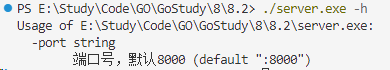

源码链接：[flag.go - Go](https://cs.opensource.google/go/go/+/refs/tags/go1.24.3:src/flag/flag.go)

用途：flag包用于实现命令行参数的解析。它允许你定义程序可以接受的命令行标志，并在程序运行时解析用户提供的这些标志。
示例如下：
```go
//server.go
func main(){

    var address string

    flag.StringVar(&address, "port", ":8000", "端口号，默认8000")

    flag.Parse()

    fmt.Println(address)

    ListenAndServer(string(":" + address))

}
```

运行 `./server.exe -h` ,显示


